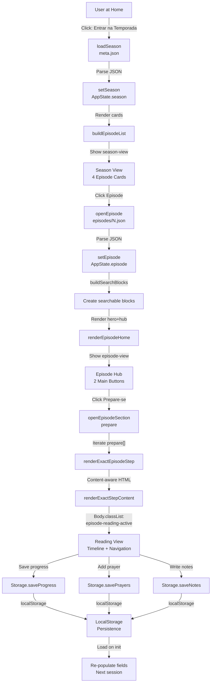
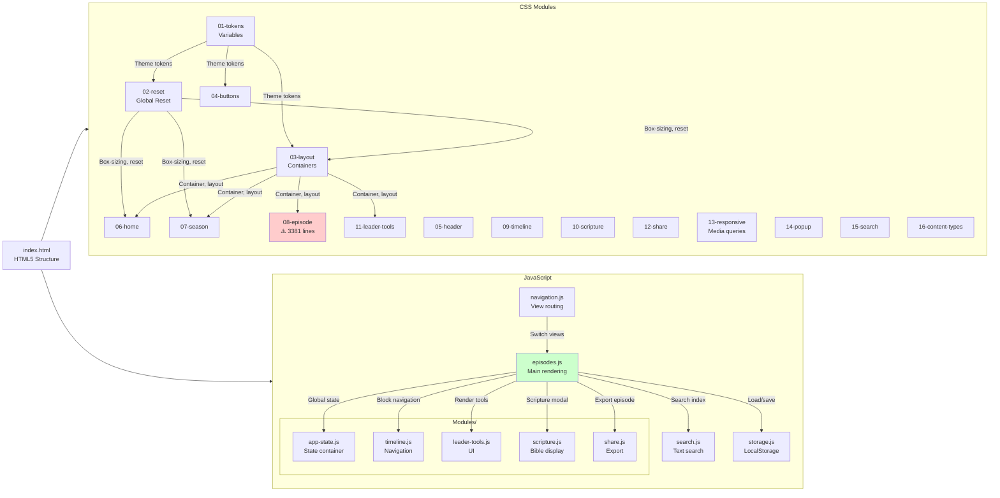
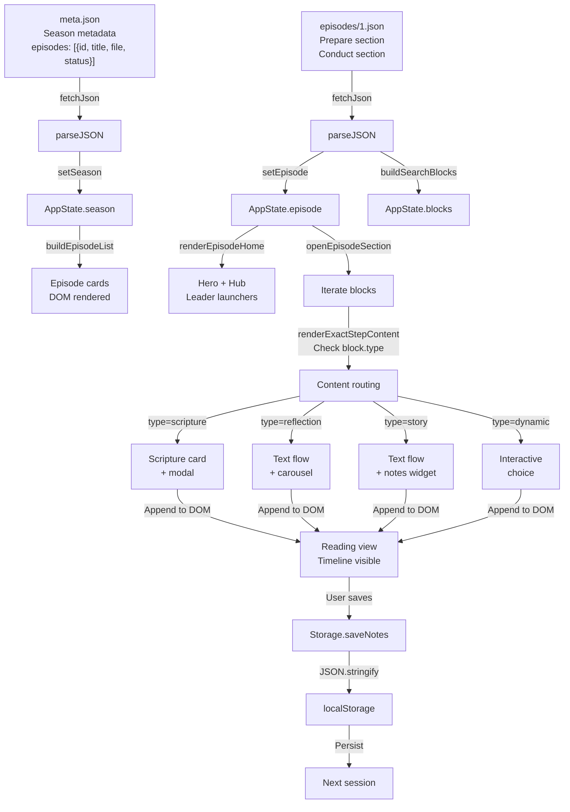
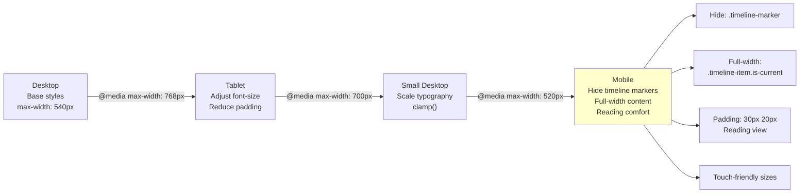
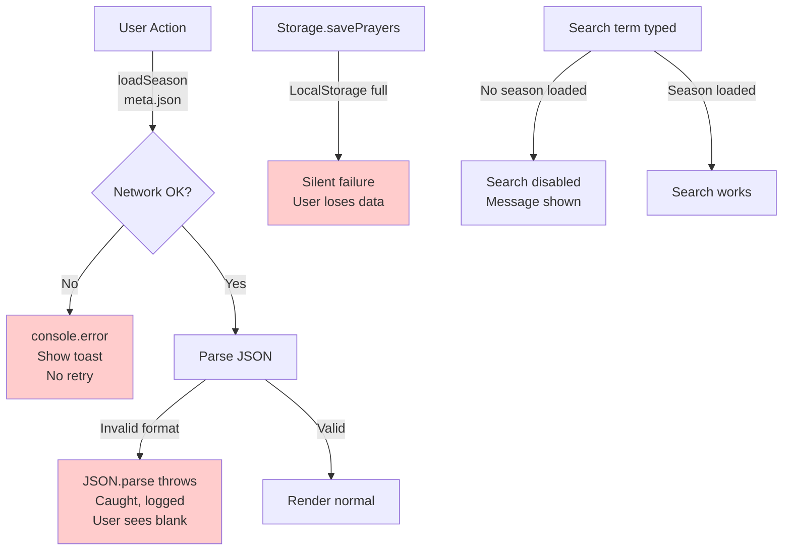

# Visual Architecture Diagrams

## Component Interaction Flow



## Module Dependency Tree



## Data Flow: JSON to DOM



## Responsive Design Breakpoints



## CSS Override Problem: Correção v7

```
File: 08-episode.css

Line ~385 (Initial Design):
────────────────────────────
.reference-step {
  margin-bottom: 56px;
}
.reference-dot {
  width: 18px;
  height: 18px;
  box-shadow: 0 0 0 12px ...;
}
.reference-step-body:not(.no-card) {
  padding: 28px;
}
                ↓ (Later in file)
                
Line ~2478 (Correção v7):
────────────────────────────
/* Correção v7 — ajustes solicitados... */

.reference-step {
  margin-bottom: 34px !important;  ← WINS (smaller spacing)
}
.reference-dot {
  width: 10px !important;           ← WINS (smaller dot)
  height: 10px !important;
}
.reference-step-body:not(.no-card) {
  padding: 22px !important;         ← WINS (tighter padding)
}

RESULT: Second definition wins due to !important
        → First definition is invisible/useless
        → Cascade broken by `!important` flags
```

## Error Handling Gaps



## State Management: AppState

```javascript
┌─────────────────────────────┐
│      AppState (Global)      │
│                             │
│ season: null                │ ← Current season metadata
│   .id, .title, .episodes[]  │
│                             │
│ episode: null               │ ← Current full episode
│   .id, .title, .prepare[]   │
│   .conduct[], .scripture    │
│                             │
│ scripture: null             │ ← Current verse highlight
│   .reference, .verse        │
│                             │
│ timeline: { current: 0 }    │ ← Position in reading
│                             │
└─────────────────────────────┘
       ↑           ↓
   Setters:   Getters:
   setSeason renderEpisodeHome
   setEpisode openEpisodeSection
   setScripture buildSearchBlocks
```

---

**Diagrams generated**: 2026-06-04
